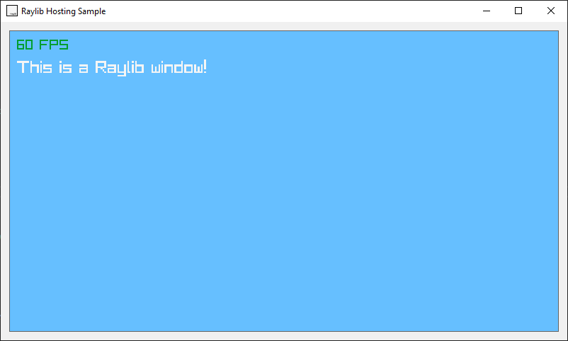

# Raylib Windows Forms Host

This is a simple project to host a Raylib rendering window inside a Windows form. This allows creating Windows Forms applications with a Raylib 3D Viewport for displaying 3D content (or just rendering 2d graphics).

## Why?

There are many applications where someone needs to have both UI controls and a graphics viewport. But the question is, why use Raylib hosted in Windows Forms? What are the other possible solutions and how do they compare?
Well, there are many ways someone can achieve this:

 - Using only Raylib with RayGUI
 - Using an OpenGL/Direct3D viewport in Windows forms
 - Using Qt (which has a 3d viewport control)

The first solution is probably the most straightforward. Just use some UI features of the rendering framework (in this case Raylib). Despite this being easy for simple applications, there are a lot of reasons why someone might decide that this is not suitable:

 1. Not everyone likes immediate mode GUIs, specially for complex applications.
 2. The 3D viewport may not always be visible or may not be required to update at a fixed framerate. In this case using a immediate mode GUI will consume unecessary performance, because this approach requires a constant update/draw loop.
 3. Immediate mode UI libraries (like ImGUI and RayGUI) contain much more less features than retained mode frameworks (such as Qt, WPF, or Windows Forms), specially when interacting with external data (eg. a database).
 4. Immediate mode UI libraries usually have a much smaller set of controls.
 5. Immediate mode UI libraries usually don't interact well out of the box with some OS UI features. For example file dialogs.

These reasons (and more) make the use of a mature retained mode GUI framework desirable.

What about the second method? using OpenGL or Direct3D to render the scene and then display it in the viewport? This is probably the best method if you want the most amount of control. But if you have ever worked with low level graphics APIs like OpenGL or Direct3D then you know that this is not an easy task. Many applications might need common features in the 3D viewport and writing a complete rendering system based on these low level APIs would be a waste of time in such case. Already available 3D graphics frameworks (such as Raylib) abstract a lot of the low level boilerplate work for common tasks and expose a simple to use  API.

Finally, why not use Qt? Qt is amazing and its 3D rendering features are great. So in this case it just a matter of preferance of whether you prefer writing GUIs in C# or C++ or which framework you prefer (Qt or Windows Forms). 

Windows Forms is old but mature native Windows GUI framework. It is still supported and has a large community with many tools and custom controls (both paid and free). If you need to do something in Windows Forms, odds are you will find someone who did it before. This makes it great for writing generic Desktop applications if you target Windows.

## Installation

## Usage (TLDR)

 1. Add a panel control to a Form (make sure to know its name)
 2. Use the `WinFormsRaylib` namespace
 3. Create a class that inherits `RaylibMultiThreadedHost` and initializes it in the constructor with a `Panel` control object
 4. Override the `RaylibIteration` method with your Raylib loop (exclude the while statement as shown in the code below)
 5. In your Form class code, create the Raylib host object and inject into it the `Panel` control.
 6. Call the `RaylibMultiThreadedHost.Start()` function in the Form load event.

The host class code:

    using Raylib_cs;
    using WinFormsRaylib;
    
    internal class ExampleMultiThreadedHost : RaylibMultiThreadedHost, IExampleHost
    {
        private object _lock = new object();

        private Ray _ray;
        private RayCollision _rayCollision;

        public ExampleMultiThreadedHost(Panel hostingPanel, string windowTitle = "WinFormsRaylib") : base(hostingPanel, windowTitle)
        {
            
        }

        protected override void RaylibIteration()
        {
                Raylib.BeginDrawing();
                Raylib.ClearBackground(Color.SkyBlue);
                Raylib.DrawFPS(10, 10);
                Raylib.DrawText("This is a Raylib window!", 10, 40, 24, Color.RayWhite);

                Raylib.EndDrawing(); 
        }
    }

The form code:

    public partial class HostForm : Form
	{
	    ExampleMultiThreadedHost raylibHost;

	    public HostForm()
	    {
	        InitializeComponent();
	        raylibHost = new ExampleMultiThreadedHost(hostingPanel, this);
	        Load += HostForm_Load;
	    }

	    private void HostForm_Load(object? sender, EventArgs e)
	    {
	        raylibHost.Start();
	    }

	}

Congratulations! Now you can are using Raylib in a Windows Forms panel.

## Usage (Advanced)

The example project in this repo (Example folder) has a more advanced demo which shows a general way of how to manage interaction in both directions. This is not so trivial since the rendering loop lies on a background thread, so multithreading considerations must be made.

For quick reference, two easy techniques (one for each direction of interaction) are provided below:

### Interacting with Raylib from the Form

To make something from the form affect the Raylib loop, we can add a function to the host class and use the `lock` statement with a lock object to manage access to the shared resources.

    private object _lock = new();
    private string _message;

    public void ChangeMessage(string newMsg)
    {
        lock(_lock)
        {
            _message = newMsg;
        }
    }

Then, of course, we place the lock in the rendering loop (it could be around only the part where the shared resource is used, but it is easier to place it on the whole loop if a lot of objects may be shared)

    lock (_lock)
    {
        Raylib.BeginDrawing();
        Raylib.ClearBackground(Color.RayWhite);
        Raylib.DrawFPS(10, 10);
        Raylib.DrawText(_message, 10, 40, 22, Color.Black);

        Raylib.EndDrawing(); 
    }

### Interacting with the Form from Raylib

To make something happen in the Form (UI) as a result from an event in the Raylib loop, you call the `BeginInvoke` function of the hosting panel control. The hosting panel is stored as a protected field in the Raylib host classes with the name `_hostingPanel`. 

If you want to avoid it you can also pass the Form object as a dependency in the constructor of your Raylib host class, which is what is done in the example (you will probably need to do so anyway as you will need access to the controls in the form).

    private void ChangeFormLabel()
    {
        _parentForm.BeginInvoke(() =>
        {
            _parentForm.SetIndicatorText("Changed from raylib!");
        });
    }

## How it works

Under the hood it is really simple. A Raylib window is created (using the Raylib_cs package) and then the Window is changed to be a child window of the panel using native WinAPI PInvokes.

Then, a Raylib thread is started which updates the Window.

The classes `AbstractRaylibHost` and `RaylibMultiThreadedHost` include the code that does this.

The class `Win32` includes some required static functions for Windows API.

